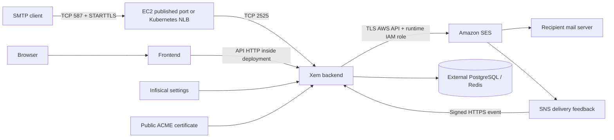

# Xem infrastructure

Terraform and Helm for Xem's API, frontend, and managed SMTP backed by Amazon SES. Optional payments and MCP services are included in the chart. Application settings and SMTP flags remain in Infisical; this repository contains no credentials.

## Choose a deployment path

| Path | Resources owned here | Prerequisites |
| --- | --- | --- |
| [Existing Dokploy/EC2](docs/terraform-adoption.md) | Imported EC2, Elastic IP, SMTP security group, runtime role/profile, existing sending CloudFormation stack | Existing VPC/subnet, administrative SG, Dokploy, external PostgreSQL and Redis |
| [Kubernetes](docs/kubernetes.md) | Workload IAM role, distinct sending stack, Helm application workloads, HTTP ingress, TCP SMTP service, optional cert-manager resources | Supported Kubernetes cluster, IAM OIDC provider, ingress controller, cert-manager, load-balancer controller, external PostgreSQL and Redis |
| [Platform domain](docs/terraform-adoption.md#platform-domain-and-cloudflare) | SES platform identity, DKIM, custom MAIL FROM, optional DMARC, DNS-only SMTP record | Cloudflare authoritative zone and scoped API token |

The Kubernetes root does **not** provision a cluster. The EC2 root is an **adoption configuration**, not an unattended new-server installer. Neither path creates databases, installs controllers, approves SES production access, or deploys the static marketing website. Those have separate lifecycles. Do not point both runtimes at the same production database with sending workers active.



Cloudflare provides authoritative DNS and ACME DNS challenges for Kubernetes. SMTP records must be DNS-only. Cloudflare Origin CA certificates are not trusted by ordinary SMTP clients; use a public CA such as Let's Encrypt.

## Layout

- `terraform/environments/{dokploy,kubernetes,domain}`: independent state roots with pinned providers.
- `terraform/modules`: reusable runtime identity, sending stack, and platform DNS modules.
- `charts/xem`: application chart; no embedded database or secret values.
- `host/` and `scripts/install-dokploy-smtp-tls.sh`: certificate export and read-only host mirror.
- `scripts/smtp-smoke.py`: transport-only test, no email or credentials.
- `legacy/`: archived Kops/manifests; **not supported deployment instructions**.

Start with [DEPLOYMENT.md](DEPLOYMENT.md). The [production snapshot](docs/production-status.md) records what was actually verified and the remaining delivery checks.

## Validate locally

Use Terraform 1.16.2, Helm 3.18.6, Python 3.12 with PyYAML 6.0.2 / jsonschema 4.23.0, and kubeconform 0.7.0. Modules require Terraform >=1.10 for S3 locking. CI uses the pinned versions and requires no AWS or Cloudflare credentials.

```bash
python3 -m pip install PyYAML==6.0.2 jsonschema==4.23.0
go install github.com/yannh/kubeconform/cmd/kubeconform@v0.7.0
bash scripts/validate.sh
python3 scripts/smtp-smoke.py smtp.xem.email
```

The validation script initializes providers with the backend disabled, runs plan-only IAM tests with dummy credentials and no AWS lookups, checks rendered manifests, and exercises certificate rotation with an ephemeral local CA. The optional smoke command contacts the named SMTP endpoint. Validation does not establish that images start in a real cluster or that SES accepts authenticated messages.

Contributions should include an example without secrets and validation for changed behavior. Preserve resource ownership and provider lockfiles. Pin application image digests before production use; the chart's mutable image defaults are discovery examples, not a reproducible production release.
